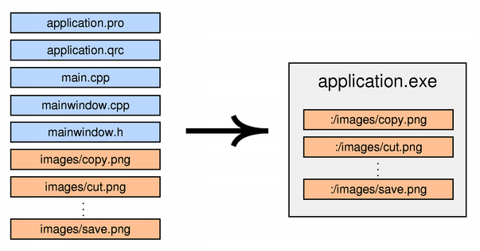

# [Qt keretrendszer](https://doc.qt.io)


---

### [Qt core](https://doc.qt.io/qt-5/qtcore-index.html)

```c++
#include <QtCore>
QT += core
```

Mirről lesz szó:

@ul

- The Meta-Object System
- The Property System
- Object Trees & Ownership
- Signals & Slots
- The Qt Resource System(qrc)
- Internationalization with Qt
- QDoc
- qmake

@ulend

---

### [The Meta-Object System](https://doc.qt.io/qt-5/metaobjects.html)

@ol

- QObject biztosítja meta-object system-et
- Q_OBJECT macro
- Meta-Object Compiler (moc) hozza létre a kódot a háttérben

@olend

TODO

---

### [The Property System](https://doc.qt.io/qt-5/properties.html)

`Q_PROPERTY()` macro

```
Q_PROPERTY(type name
           (READ getFunction [WRITE setFunction] |
            MEMBER memberName [(READ getFunction | WRITE setFunction)])
           [RESET resetFunction]
           [NOTIFY notifySignal]
           [REVISION int]
           [DESIGNABLE bool]
           [SCRIPTABLE bool]
           [STORED bool]
           [USER bool]
           [CONSTANT]
           [FINAL])
```

```
Q_PROPERTY(bool focus READ hasFocus)
Q_PROPERTY(bool enabled READ isEnabled WRITE setEnabled)
Q_PROPERTY(QCursor cursor READ cursor WRITE setCursor RESET unsetCursor)
```

+++

#### Példa

```c++
class MyClass : public QObject
{
    Q_OBJECT
    Q_PROPERTY(Priority priority READ priority WRITE setPriority NOTIFY priorityChanged)

public:
    MyClass(QObject *parent = 0);
    ~MyClass();

    enum Priority { High, Low, VeryHigh, VeryLow };
    Q_ENUM(Priority)

    void setPriority(Priority priority)
    {
        m_priority = priority;
        emit priorityChanged(priority);
    }
    Priority priority() const
    { return m_priority; }

signals:
    void priorityChanged(Priority);

private:
    Priority m_priority;
};
```
+++

```c++
MyClass *myinstance = new MyClass;
QObject *object = myinstance;

myinstance->setPriority(MyClass::VeryHigh);
object->setProperty("priority", "VeryHigh");
```

---

### [Object Trees & Ownership](https://doc.qt.io/qt-5/objecttrees.html)

```
QObject(QObject *parent = nullptr)
children() 
```

#### Construction/Destruction Order of QObjects

@ul

- Bármilyen sorrendben lehet fát építeni
- Bármilyen sorrendben lehet törölni a fában
- Egyetlen egy QObject se lesz kétszer törölve függetlenül a törlés sorrendjétől

@ulend

---

### [Signals & Slots](https://doc.qt.io/qt-5/signalsandslots.html)


+++

meta-object systemnek köszönhető

Object-ek közötti kommunikációra, callback módszer helyett, még a szálakkal sem kell foglalkozni.

@ul

- **Signal** esemény/event
- **Slot** egyszerű függvény, Signal vételére is használható
- **emit** signal küldésére bárhonnan az object-ből
- **connect**(küldő, ..., vevő, ...)

@ulend

A **Signal** signature-nek meg kell egyeznie a **Slot** signature-el.

+++

#### Connect használata

##### egy parameterrel rendelkező függvények esetén:

connect(küldő, &fv, vevő, &fv)

##### legszerűbb megoldás:

connect(küldő, SIGNAL(fv(int x, double y)), vevő, SLOT(int x, double y))

Default value esetén a SIGNAL-ben található függvény argumentumai nem lehet kevesebb, mint a SLOT-ban

+++

```c++
void destroyed(QObject* = 0);
void objectDestroyed(QObject* obj = 0);

connect(sender, SIGNAL(destroyed(QObject*)), this, SLOT(objectDestroyed(Qbject*)));
connect(sender, SIGNAL(destroyed(QObject*)), this, SLOT(objectDestroyed()));
connect(sender, SIGNAL(destroyed()), this, SLOT(objectDestroyed()));
```

##### Rossz:

```c++
connect(sender, SIGNAL(destroyed()), this, SLOT(objectDestroyed(QObject*)));
```

+++

##### Egy Osztályban példa:

```c++
foo.h
...
signals:
	void clicked();

bar.h
...
public slots:
	void close();

connect(foo, &clicked, bar, &slots);
```

+++

#### Példa

```c++
#include <QObject>

class Counter : public QObject
{
    Q_OBJECT

public:
    Counter() { m_value = 0; }

    int value() const { return m_value; }

public slots:
    void setValue(int value);

signals:
    void valueChanged(int newValue);

private:
    int m_value;
};
    
void Counter::setValue(int value)
{
    if (value != m_value) {
        m_value = value;
        emit valueChanged(value);
    }
}
```

+++

```c++
Counter a, b;
QObject::connect(&a, &Counter::valueChanged,
                 &b, &Counter::setValue);

a.setValue(12);     // a.value() == 12, b.value() == 12
b.setValue(48);     // a.value() == 12, b.value() == 48
```

---

### [The Qt Resource System](https://doc.qt.io/qt-5/resources.html)(qrc)

Platform függetlenül tárolja a bináris fájlokat a futtatható alkalmazásban.

.qrc XML

```xml
<!DOCTYPE RCC><RCC version="1.0">
<qresource>
    <file>images/copy.png</file>
    <file>images/cut.png</file>
    <file>images/new.png</file>
    <file>images/open.png</file>
    <file>images/paste.png</file>
    <file>images/save.png</file>
</qresource>
</RCC>
```

+++

#### Elérése

:/ használatával



#### qmake(.pro)

```RESOURCES     = application.qrc```

---

### [Internationalization with Qt](https://doc.qt.io/qt-5/internationalization.html)

#### A **tr()** macro használatával lehetséges

```tr("Hello %1!").arg("World");```

#### qmake(.pro) TRANSLATIONS

```TRANSLATIONS = TranslationExample_en.ts```

#### Fordítás folyamata:

```
lupdate TranslationExample.pro
linguist TranslationExample_en.ts
lrelease TranslationExample.pro
```

+++

#### Maga a kódban:

```c++
int main(int argc, char *argv[])
{
    QApplication app(argc, argv);

    QTranslator qtTranslator;
    qtTranslator.load("qt_" + QLocale::system().name(),
            QLibraryInfo::location(QLibraryInfo::TranslationsPath));
    app.installTranslator(&qtTranslator);

    QTranslator myappTranslator;
    myappTranslator.load("myapp_" + QLocale::system().name());
    app.installTranslator(&myappTranslator);

    ...
    return app.exec();
}
```
---

### [QDoc](https://doc.qt.io/qt-5/qdoc-guide.html)

Mintapélda [doc.qt.io](https://doc.qt.io)


+++

- **QDoc** binary
- **qdocconf** configuration files
- Documentation in C++, QML, and **.qdoc** files

---

### [qmake](https://doc.qt.io/qt-5/qmake-manual.html)

TODO